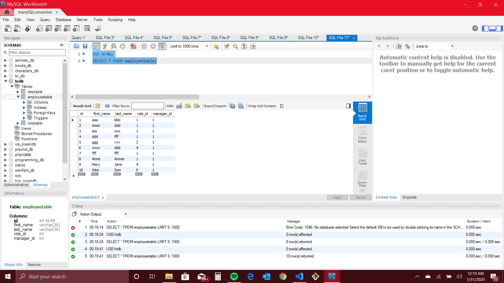

# CMS - Employee Tracker
Architect an application that builds a solution for managing a company's employees, to help the user organize and plan the  business. The application allows the user to view and manage the departments, roles, and employees in the company. 
The command-line application should allow users to: 
- add departments, roles, employees 
- view departments, roles, employees 
- update employee's roles

# Motivation
Build a solution for managing a company's employees using node, inquirer, and MySQL. 

# Prerequisites
The software will run in any Laptop, iPad and phone.

# Results 
*  The command-line application should: add departments, roles, employees; view departments, roles, employees; update employee roles

## Submission 
 The URL of the GitHub repository

## Screenshots

* Screen shots for : "View all employees"

This screenshot shows the result for "View all employees".  It shows all employees in teh employeeTable (first name, last name, roleid). For the first employee, I managed to get from the roleTable the Title, salary and department id. SO, I could access the role table, but I think there was a code error that prevented me to get the rest of the info. I am going to try to fix it.  

Thsi screenshot shows the database table that was used as source for screen2

* The screenshot shots for "Add employee option"

The screenshot shot shows "Add employee option" chosen and all the prompts. At the end of the prompts for that employee it shows the fist name and last name of the employee recently placed in teh table. The info first/last name has been extracted form the database. 

This screenshot shows more employees added to data base, just like screen 4.

This screenshot shows the database complete with the employee added in screens 4 and 5. Check it out! The names are all there! :)

## Tests 
* tested all entries   

## Author
Maria Dawes-Tedesc0

## Contributing
Please read [CONTRIBUTING.md](https://gist.github.com/PurpleBooth/b24679402957c63ec426) for details on our code of conduct, and the process for submitting pull requests to us.

# Versioning
For the versions available, see https://github.com/MariaDawes/Template-Engine/commits/master

# Acknowledgement
Thanks to Eric to help me when I was stuck.

