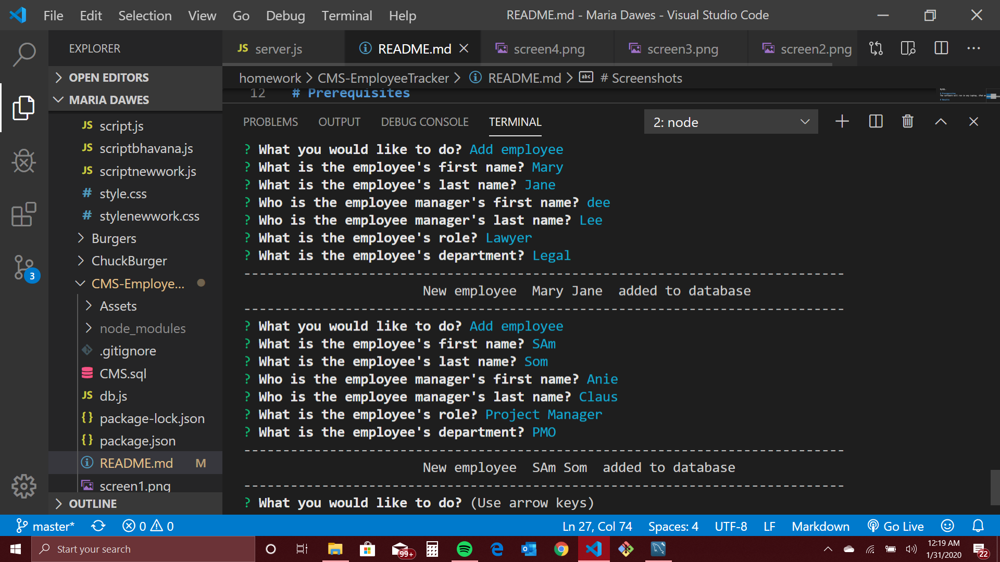

# CMS - Employee Tracker
Architect an application that builds a solution for managing a company's employees, to help the user organize and plan the business. The application allows the user to view and manage the departments, roles, and employees in the company. 
The command-line application should allow users to: 
- add departments, roles, employees 
- view departments, roles, employees 
- update employee's roles

# Motivation
Build a solution for managing a company's employees using node, inquirer, and MySQL. 

# Prerequisites
The software will run in any Laptop, iPad and phone.

# Results 
*  The command-line application should provide full access to performing inclusing, update and deletion of employees in a database. Also, it should allow slicing the data for viewing in many different ways.

## Submission 
 The URL of the GitHub repository has been added to BootCamp Spot

## Screenshots

* "Add employee" option Screenshots

Screen 1 - Above you can see the prompts for "Add employee" option, for adding new employees to the database. Also, shows the successfule result of the employee being added to the database - message "New employee (fist name and last name)  added to the database". The info first/last name has been extracted directly from the database. Please note that the prompt for "What you would like to do?" shows again, allowing user to pick another option or finish the program (exit) 

Screen 2 - More examples of employees getting added to the database, just like Screen 1.

Screen 3 - This screenshot shows the database complete in Workbench with all the employee added in screens 1 and 2. Check it out! The names are all there! :)

* "View all employees" option Screenshots

Screen 4 - Above you can see the result for "View all employees".  It shows all employees in the employeeTable (first name, last name, roleid). For the first employee, I managed to get from the roleTable the Title, salary and department id. So, I could access the role table, but I think there was a code error that prevented me to get the rest of the info. I am going to try to fix it.  

Screen 5 - This is the database table that was used as source for Screen 4"

## Tests 
* name validation - characters
* prompts have been tested for functionality

## Author
Maria Dawes-Tedesc0

## Contributing
Please read [CONTRIBUTING.md](https://gist.github.com/PurpleBooth/b24679402957c63ec426) for details on our code of conduct, and the process for submitting pull requests to us.

# Versioning
For the versions available, see https://github.com/MariaDawes/Template-Engine/commits/master

# Acknowledgement
Thanks to Eric for helping me with my code when I was stuck.

